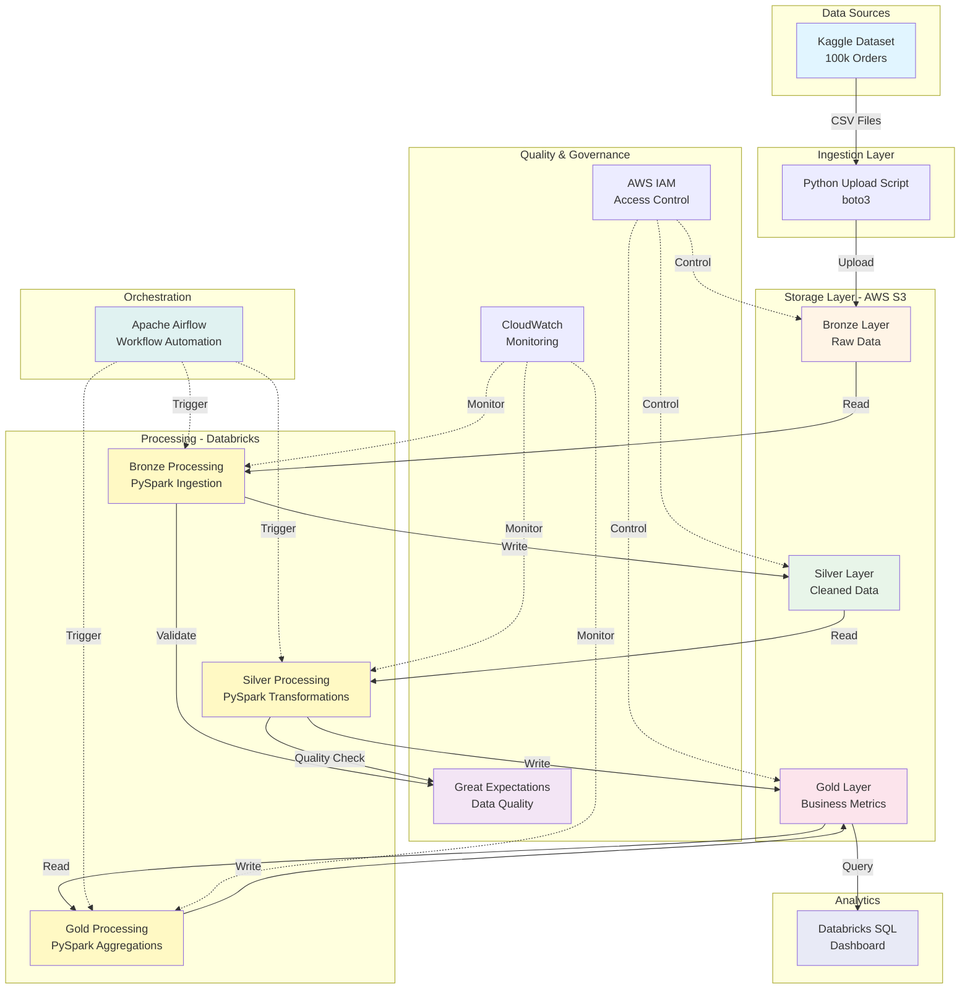

# 🏗️ Architecture Overview

## Table of Contents
- [High-Level Architecture](#high-level-architecture)
- [Medallion Architecture Pattern](#medallion-architecture-pattern)
- [Component Details](#component-details)
- [Data Flow](#data-flow)
- [Security & Governance](#security--governance)
- [Technology Stack](#technology-stack)

---

## High-Level Architecture


---

## Medallion Architecture Pattern

### **Why Medallion Architecture?**

The **Medallion Architecture** (aka **Multi-Hop Architecture**) is a modern data design pattern for data platforms used to organize data logically.
The goal is to incermentally and progressively improve the structure and quality of data as it flows through each layer of the architecture (from Bronze ⇒ Silver ⇒ Gold layer tables).

### **The Three Layers:**
```
┌─────────────────────────────────────────────────────────────┐
│  BRONZE LAYER (Raw Zone)                                    │
│  Purpose: Ingestion & Historical Archive                    │
│  ─────────────────────────────────────────────────────────  │
│  • Raw data, immutable                                      │
│  • Format: Parquet                                          │
│  • Partition: date, source                                  │
│  • Immutable (append-only)                                  │
│  • Schema validation                                        │
└────────────────────┬────────────────────────────────────────┘
                     │
                     ▼
┌─────────────────────────────────────────────────────────────┐
│  SILVER LAYER (Refined Zone)                                │
│  Purpose: Cleaned, Conformed, Enriched                      │
│  ─────────────────────────────────────────────────────────  │
│  • Deduplication                                            │
│  • Type casting & validation                                │
│  • Tables  joins                                            │
│  • Enrich data (geo, temporal features)                     │
│  • Data quality checks (Great Expectations)                 │
│  • Slowly Changing Dimensions (SCD Type 2)                  │
└────────────────────┬────────────────────────────────────────┘
                     │
                     ▼
┌─────────────────────────────────────────────────────────────┐
│  GOLD LAYER (Curated Zone)                                  │
│  Purpose: Business-Level Aggregations                       │
│  ─────────────────────────────────────────────────────────  │
│  • KPIs e-commerce (CLV, churn, etc.)                       │
│  • Pre-aggregated data for dashboards                       │
│  • Star schema / Data Mart                                  │
│  • Query optimised for BI                                   │
│  • Business documentation                                   │
└─────────────────────────────────────────────────────────────┘
```

### **Benefits:**

| Benefit | Description |
|---------|-------------|
| **Incremental Processing** | Process only new data (delta), not full reloads |
| **Data Quality Gates** | Validate at each layer before promotion |
| **Time Travel** | Keep historical versions for audit/recovery |
| **Performance** | Pre-aggregated gold tables = fast dashboards |
| **Flexibility** | Re-process silver/gold without touching bronze |
| **Collaboration** | Clear boundaries between data engineers & analysts |

---

## Component Details

### **1. Data Sources**

#### **Kaggle E-Commerce Dataset (Olist)**
- **Source:** Brazilian E-Commerce Public Dataset
- **Period:** 2016-2018
- **Records:** ~100,000 orders
- **Tables:** 8 relational tables

**Schema:**
```
orders (99,441 rows)
├── order_id (PK)
├── customer_id (FK)
├── order_status
├── order_purchase_timestamp
└── ...

order_items (112,650 rows)
├── order_id (FK)
├── product_id (FK)
├── price
└── freight_value

customers (99,441 rows)
products (32,951 rows)
sellers (3,095 rows)
product_category (71 rows)
geolocation (1,000,163 rows)
order_reviews (99,224 rows)
order_payments (103,886 rows)
```

### **2. Ingestion Layer**

#### **Python Upload Script**
```python
# scripts/upload_to_s3.py
- Reads CSV files from data/raw/
- Uploads to S3 bronze/ with partitioning
- Handles incremental uploads (delta detection)
- Error handling & retry logic
- Logging to CloudWatch
```

**Features:**
- ✅ Batch upload with multipart for large files
- ✅ Data validation before upload
- ✅ Idempotent (can re-run safely)
- ✅ Progress tracking

### **3. Storage Layer - AWS S3**

#### **Bucket Structure:**
```
s3://kaggle-e-commerce-datalake-us-east-1/
│
├── bronze/
│   ├── orders/
│   │   └── date=2024-02-19/
│   │       └── orders.parquet
│   ├── customers/
│   ├── products/
│   └── ...
│
├── silver/
│   ├── orders_cleaned/
│   │   └── date=2024-02-19/
│   ├── customer_enriched/
│   └── ...
│
├── gold/
│   ├── customer_lifetime_value/
│   ├── daily_revenue/
│   ├── product_performance/
│   └── ...
│
└── archive/
    └── (data > 90 days via lifecycle policy)
```

**S3 Features Used:**
- **Partitioning:** Improved query performance
- **Lifecycle Policies:** Auto-archive to Glacier after 90 days
- **Versioning:** Recovery from accidental deletes
- **Encryption:** SSE-S3 (Server-Side Encryption)

### **4. Processing - Databricks (PySpark)**

#### **Bronze Processing**
```python
# notebooks/bronze/01_ingest_orders.py

Purpose: Ingest raw CSV to Parquet with minimal transformation

Steps:
1. Read CSV from local/S3
2. Infer schema (or apply explicit schema)
3. Add metadata columns:
   - ingestion_timestamp
   - source_file
   - data_quality_flag
4. Write to bronze/ as Parquet (partitioned by date)
5. Log metrics (row count, file size, duration)
```

#### **Silver Processing**
```python
# notebooks/silver/02_transform_orders.py

Purpose: Clean, validate, and enrich data

Transformations:
1. Deduplication (based on order_id + timestamp)
2. Type casting (strings → dates, decimals)
3. Null handling (drop/impute based on business rules)
4. Outlier detection (price < 0, shipping_days > 365)
5. Join with dimension tables (customers, products)
6. Add computed columns:
   - delivery_time_days
   - is_delayed (boolean)
   - customer_segment (RFM)
7. Data quality validation (Great Expectations)
8. Write to silver/ with SCD Type 2 for historical tracking
```

#### **Gold Processing**
```python
# notebooks/gold/03_aggregate_metrics.py

Purpose: Create business-ready KPIs

Aggregations:
1. Customer Lifetime Value (CLV)
   - Total revenue per customer
   - Average order value
   - Purchase frequency

2. Product Performance
   - Revenue by category
   - Top sellers
   - Inventory turnover

3. Delivery SLA
   - On-time delivery rate
   - Average delivery time by region
   - Carrier performance

4. Churn Analysis
   - Days since last purchase
   - Predicted churn probability (features for ML)

5. Daily/Monthly Revenue
   - Time series aggregations
   - Year-over-year growth
```

### **5. Data Quality & Governance**

#### **Great Expectations**

**Expectation Suites:**
```yaml
# Bronze Layer Expectations
orders_bronze_suite:
  - expect_column_to_exist: order_id
  - expect_column_values_to_be_unique: order_id
  - expect_column_values_to_not_be_null: order_id
  - expect_column_values_to_be_of_type: 
      column: order_purchase_timestamp
      type_: datetime

# Silver Layer Expectations
orders_silver_suite:
  - expect_column_values_to_be_between:
      column: price
      min_value: 0
      max_value: 10000
  - expect_column_values_to_be_in_set:
      column: order_status
      value_set: [delivered, shipped, canceled, processing]
  - expect_table_row_count_to_be_between:
      min_value: 90000
      max_value: 110000
```

#### **AWS IAM (Role-Based Access Control)**
```hcl
# infrastructure/aws/iam.tf

Roles:
- data-engineer-role (Read/Write bronze, silver, gold)
- data-analyst-role (Read-only gold)
- airflow-role (Execute jobs, write logs)

Policies:
- S3 least-privilege access (specific buckets only)
- CloudWatch write-only logs
- Databricks service account (programmatic access)
```

### **6. Orchestration - Apache Airflow**

**DAG Structure:**
```python
# pipelines/dags/daily_ecommerce_pipeline.py

DAG: daily_ecommerce_etl
Schedule: 0 2 * * * (Daily at 2 AM UTC)

Tasks:
[Start] 
  → [Validate S3 bronze files exist]
  → [Run bronze_ingestion (Databricks job)]
  → [Data quality checks (Great Expectations)]
  → [Run silver_transformations (Databricks job)]
  → [Data quality checks]
  → [Run gold_aggregations (Databricks job)]
  → [Update dashboard metadata]
  → [Send success notification (email/Slack)]
[End]

Error Handling:
- Retry 3 times with exponential backoff
- Alert on failure via Slack webhook
- Quarantine bad data to separate S3 path
```

### **7. Analytics - Databricks SQL**

**Dashboard KPIs:**

1. **Executive Summary**
   - Total Revenue (MTD, YTD)
   - Active Customers
   - Average Order Value
   - Delivery Performance %

2. **Product Analytics**
   - Top 10 products by revenue
   - Category performance
   - Inventory levels

3. **Customer Insights**
   - Customer segmentation (RFM)
   - Cohort analysis
   - Churn rate

4. **Operational Metrics**
   - Pipeline SLA (processing time)
   - Data freshness (last update timestamp)
   - Error rate

---

## Data Flow

### **End-to-End Flow Example**
```
1. USER ACTION (2016-09-04 21:15:19)
   └─> Customer places order on e-commerce platform

2. TRANSACTIONAL SYSTEM
   └─> Order data written to OLTP database

3. DATA EXPORT (simulated by Kaggle dataset)
   └─> CSV export: orders.csv, order_items.csv, etc.

4. INGESTION (Daily @ 2 AM)
   └─> Python script uploads CSV → S3 bronze/
   └─> Format: s3://kaggle-e-commerce-datalake-us-east-1/bronze/orders/date=2024-02-19/orders.parquet

5. BRONZE PROCESSING (2:05 AM)
   └─> Databricks reads S3 bronze
   └─> Minimal validation (schema check)
   └─> Writes back to bronze/ as Parquet (immutable)

6. SILVER PROCESSING (2:15 AM)
   └─> Reads bronze Parquet
   └─> Cleans: dedup, type cast, null handling
   └─> Enriches: joins customers, products
   └─> Validates: Great Expectations suite
   └─> Writes to silver/ (overwrite daily partition)

7. GOLD PROCESSING (2:30 AM)
   └─> Reads silver tables
   └─> Aggregates: daily revenue, CLV, churn features
   └─> Writes to gold/ (append to time series)

8. ANALYTICS (Real-time)
   └─> Databricks SQL Dashboard queries gold/
   └─> Business users see updated KPIs
   └─> Analysts run ad-hoc SQL queries

9. GOVERNANCE
   └─> CloudWatch logs all operations
   └─> Data lineage tracked in metadata
   └─> Audit trail for compliance
```

---

## Security & Governance

### **Security Layers**
```
┌─────────────────────────────────────────────────────┐
│  Network Security                                   │
│  • VPC with private subnets (if production)         │
│  • Security groups (allow only necessary ports)     │
└─────────────────────────────────────────────────────┘
              ↓
┌─────────────────────────────────────────────────────┐
│  Identity & Access (IAM)                            │
│  • Least-privilege roles                            │
│  • MFA enforced for admin access                    │
│  • Service accounts with temporary credentials      │
└─────────────────────────────────────────────────────┘
              ↓
┌─────────────────────────────────────────────────────┐
│  Data Security                                      │
│  • S3 encryption at rest (SSE-S3)                   │
│  • Encryption in transit (TLS 1.2+)                 │
│  • No PII in bronze/silver (anonymized in gold)     │
└─────────────────────────────────────────────────────┘
              ↓
┌─────────────────────────────────────────────────────┐
│  Secrets Management                                 │
│  • Never commit credentials to Git                  │
│  • .env files (local) + .gitignore                  │
│  • AWS Secrets Manager (production)                 │
└─────────────────────────────────────────────────────┘
              ↓
┌─────────────────────────────────────────────────────┐
│  Monitoring & Auditing                              │
│  • CloudWatch logs (all S3 access)                  │
│  • CloudTrail (API calls audit)                     │
│  • Data lineage (source → destination tracking)     │
└─────────────────────────────────────────────────────┘
```

### **Data Governance Practices**

| Practice | Implementation |
|----------|----------------|
| **Data Catalog** | Databricks Unity Catalog (metadata + lineage) |
| **Data Quality** | Great Expectations (automated validation) |
| **Schema Evolution** | Parquet schema merging (backward compatible) |
| **Retention Policy** | S3 Lifecycle: archive after 90 days → Glacier |
| **Disaster Recovery** | S3 versioning + cross-region replication (if critical) |
| **Compliance** | GDPR-ready (PII anonymization, right to deletion) |

---

## Technology Stack

### **Complete Stack Overview**
```
┌─────────────────────────────────────────────────────────┐
│  CLOUD INFRASTRUCTURE                                   │
│  • AWS S3 (Data Lake)                                   │
│  • AWS IAM (Access Control)                             │
│  • AWS CloudWatch (Monitoring)                          │
│  • AWS Glue Catalog (Metadata - optional)               │
└─────────────────────────────────────────────────────────┘

┌─────────────────────────────────────────────────────────┐
│  COMPUTE & PROCESSING                                   │
│  • Databricks Community (PySpark runtime)               │
│  • Python 3.9+ (scripting, automation)                  │
│  • Apache Spark 3.5.0 (distributed processing)          │
└─────────────────────────────────────────────────────────┘

┌─────────────────────────────────────────────────────────┐
│  DATA TRANSFORMATION                                    │
│  • dbt-core (SQL-based transformations)                 │
│  • PySpark DataFrames (complex logic)                   │
│  • Delta Lake format (ACID transactions - optional)     │
└─────────────────────────────────────────────────────────┘

┌─────────────────────────────────────────────────────────┐
│  DATA QUALITY & TESTING                                 │
│  • Great Expectations (validation framework)            │
│  • pytest (unit tests)                                  │
│  • data-diff (comparing datasets)                       │
└─────────────────────────────────────────────────────────┘

┌─────────────────────────────────────────────────────────┐
│  ORCHESTRATION                                          │
│  • Apache Airflow 2.8+ (workflow automation)            │
│  • GitHub Actions (CI/CD)                               │
└─────────────────────────────────────────────────────────┘

┌─────────────────────────────────────────────────────────┐
│  INFRASTRUCTURE AS CODE                                 │
│  • Terraform (AWS provisioning)                         │
│  • boto3 (Python SDK for AWS)                           │
└─────────────────────────────────────────────────────────┘

┌─────────────────────────────────────────────────────────┐
│  VERSION CONTROL & COLLABORATION                        │
│  • Git (version control)                                │
│  • GitHub (repository hosting)                          │
│  • Conventional Commits (standardized messages)         │
└─────────────────────────────────────────────────────────┘

┌─────────────────────────────────────────────────────────┐
│  ANALYTICS & VISUALIZATION                              │
│  • Databricks SQL (interactive queries)                 │
│  • Streamlit (optional dashboards)                      │
│  • Power BI / Tableau (via S3 export)                   │
└─────────────────────────────────────────────────────────┘
```

### **Development Environment**
```yaml
IDE: VSCode
Extensions:
  - Python
  - Databricks
  - Terraform
  - GitLens
  - Rainbow CSV
  - SQLTools

Python Version: 3.9+
Virtual Environment: venv
Package Manager: pip
Linter: pylint, flake8
Formatter: black
```

---

## Design Principles

### **1. Idempotency**
> Running the same pipeline multiple times produces the same result

- Bronze: Append-only (never overwrite)
- Silver/Gold: Partition overwrite (daily partitions)
- All operations have unique IDs (order_id, ingestion_timestamp)

### **2. Incremental Processing**
> Process only new data, not full table scans

- Bronze: Date partitioning (process only new dates)
- Silver: Delta detection (compare timestamps)
- Gold: Incremental aggregations (merge, not rebuild)

### **3. Data Quality First**
> Validate early, fail fast

- Schema validation at bronze ingestion
- Business rule checks at silver transformation
- Anomaly detection before gold promotion
- Quarantine bad data (don't drop, investigate)

### **4. Documentation as Code**
> Documentation lives with the code

- ADRs for major decisions
- Inline comments for complex logic
- dbt docs auto-generated from SQL
- Architecture diagrams versioned in Git

### **5. Observability**
> Know what's happening in production

- Structured logging (JSON format)
- Metrics: row counts, processing time, error rate
- Alerts: data freshness SLA, pipeline failures
- Data lineage: source → destination tracking

---

## Future Enhancements

### **Phase 2 (Next 3 months)**
- [ ] Implement Delta Lake for ACID transactions
- [ ] Add ML features for churn prediction
- [ ] Real-time streaming with Kafka
- [ ] dbt incremental models

### **Phase 3 (6 months)**
- [ ] Multi-region replication
- [ ] Data mesh architecture (domain-oriented)
- [ ] Advanced anomaly detection
- [ ] Self-service analytics portal

---

## References

- [Medallion Architecture - Databricks](https://www.databricks.com/glossary/medallion-architecture)
- [Data Quality with Great Expectations](https://greatexpectations.io/)
- [AWS S3 Best Practices](https://docs.aws.amazon.com/AmazonS3/latest/userguide/best-practices.html)
- [Airflow Best Practices](https://airflow.apache.org/docs/apache-airflow/stable/best-practices.html)

---

**Last Updated:** 2024-02-22  
**Author:** [Hatem BEN SALEM]  
**Version:** 1.0